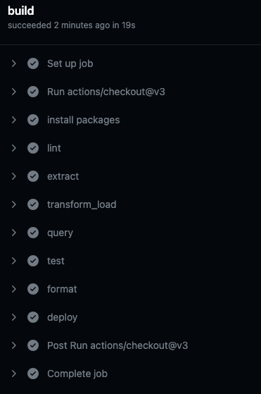

## Jiechen_Li_Mini_5_SQLite

### Purpose
* To connect to a SQL database
* To perform CRUD operations
* To write at least two different SQL queries

### Lab

* Use an AI Assistant, but use a different one then you used from a previous lab (Anthropic's Claud, Bard, Copilot, CodeWhisperer, Colab AI, etc)
* ETL-Query:  [E] Extract a dataset from URL, [T] Transform, [L] Load into SQLite Database and [Q] Query
For the ETL-Query lab:
* [E] Extract a dataset from a URL like Kaggle or data.gov. JSON or CSV formats tend to work well.
* [T] Transform the data by cleaning, filtering, enriching, etc to get it ready for analysis.
* [L] Load the transformed data into a SQLite database table using Python's sqlite3 module.
* [Q] Write and execute SQL queries on the SQLite database to analyze and retrieve insights from the data.

### Results

### Reference
Please click <a href="https://github.com/nogibjj/sqlite-lab" target="_blank">here</a> to see the template of this repo.
